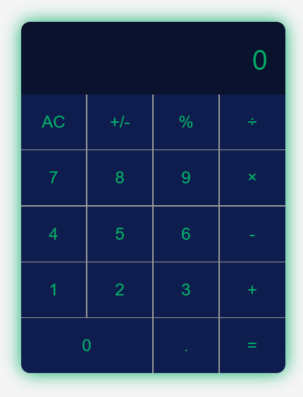
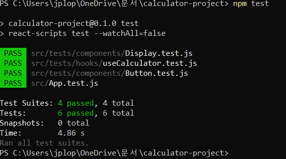
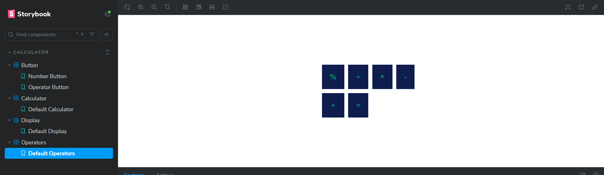
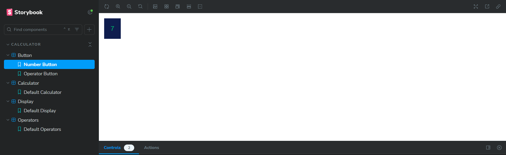
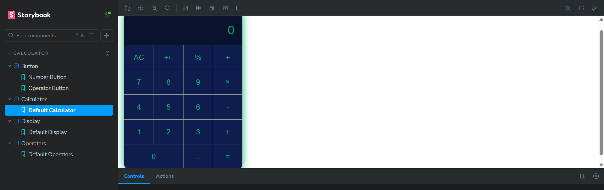
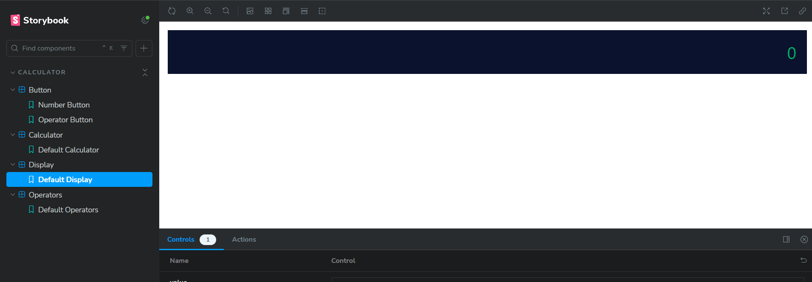
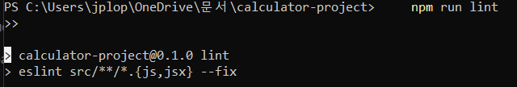

# Calculadora React

Este es un proyecto de calculadora desarrollado con React. Incluye pruebas automatizadas, integración con Storybook.

## Cómo ejecutar el proyecto

### Instalación

1. Clona el repositorio:
   ```bash
   git clone https://github.com/JPLopez23/calculator-project.git
   cd ruta donde clonaste el repo

2. Instalar dependencias
    npm install
    npm start 
    Luego abre en tu navegador http://localhost:3000 
    
    Para acceder a los tests 
    npm test
    
    Para acceder a los StoryBooks
    npm run storybook	
    Luego abre en tu navegador http://localhost:6006
    
    Script lint 
    npm run lint

3. Capturas de pantalla

   

   

   
   
   
   

   
